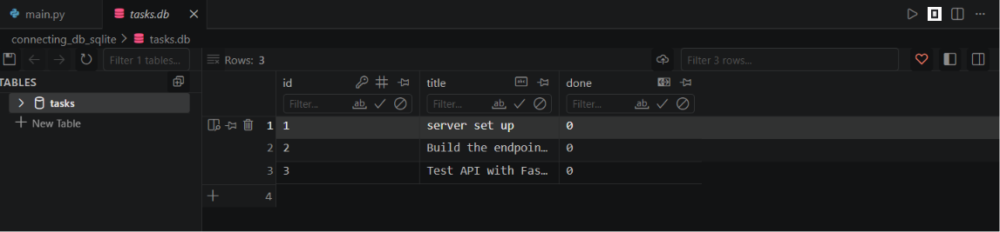

# Task Manager API

A lightweight RESTful CRUD API for managing a to-do list, built with **Python**, **FastAPI**, **SQLAlchemy 2.0**, and **SQLite**. Supports full CRUD operations with zero-configuration persistent storage.  
*(Assignment Code: BE-02 -- W3 · A2 Connecting to the database)* 

---

## Why SQLite?

SQLite was chosen for this project because it provides a **zero-configuration, serverless database** that requires no separate installation or containerization. Since Docker is not available in this environment, SQLite offers the ideal solution:

- **No setup required** - SQLite is built directly into Python's standard library. No extra services, ports, or credentials to manage.
- **File-based persistence** - The entire database lives in a single `.db` file on disk, making it trivial to back up, inspect, or reset.
- **Perfect for single-user or low-concurrency apps** - For a personal task manager API, SQLite handles reads and writes efficiently without the overhead of a client-server database.
- **Portable** - You can move the `.db` file between machines and it just works.
- **Great for learning and prototyping** - SQLAlchemy abstracts away the dialect differences, so the code is identical whether you use SQLite, PostgreSQL, or MySQL.

> **Trade-off:** SQLite locks the entire database during writes, so it is not suited for high-concurrency production systems with thousands of simultaneous users. For small-scale use, it is the pragmatic choice.

---

## Database File Location

The SQLite database file is stored in the project root directory:

```
./tasks.db
```

This file is created automatically on first run when `Base.metadata.create_all(engine)` is executed. It persists across server restarts.

If you want to start fresh, simply delete `tasks.db` and restart the server, the tables will be recreated automatically.

---

## How to Run the Server

### Prerequisites

- Python 3.11 or higher
- `pip` package manager

### Quick Start

1. **Clone the repository** and navigate to the project directory.

2. **Create your environment file:**

   ```bash
   cp .env.example .env
   ```

   The default `.env` uses SQLite out of the box, no changes needed for basic setup.

3. **Create a virtual environment (recommended):**

   ```bash
   python -m venv venv
   venv\Scripts\activate  # On Mac: source venv/bin/activate
   ```

4. **Install dependencies:**

   ```bash
   pip install -r requirements.txt
   ```

5. **Run the server:**

   ```bash
   uvicorn main:app --reload
   ```

   The server will:
   - Create `tasks.db` automatically if it doesn't exist
   - Create the `tasks` table on startup
   - Be available at `http://localhost:8000`

### Stop the Server

Press `Ctrl+C` in the terminal.

### Reset the Database

```bash
rm tasks.db
```

Then restart the server - a fresh empty database will be created.

---

## API Endpoints

| CRUD | HTTP Method | Endpoint | Description |
|------|-------------|----------|-------------|
| **Read** | `GET` | `/` | Returns basic API info and version. |
| **Read** | `GET` | `/health` | Health check to verify the server is running. |
| **Read** | `GET` | `/tasks` | Lists all tasks. Supports optional query parameters `?done=true` and `?search=keyword`. |
| **Read** | `GET` | `/tasks/{id}` | Retrieves a specific task by its ID. Returns 404 if not found. |
| **Create** | `POST` | `/tasks` | Creates a new task. Requires a JSON body with a `title`. |
| **Update** | `PUT` | `/tasks/{id}` | Updates a task's `title` and/or `done` status. |
| **Delete** | `DELETE` | `/tasks/{id}` | Deletes a task by its ID. |
| *Extra* | `GET` | `/stats` | Returns statistics on total, done, and open tasks. |

---

## Example Requests

### Fetch all tasks

```bash
curl -i http://localhost:8000/tasks
```

### Fetch a single task

```bash
$ curl -i http://localhost:8000/tasks/1
HTTP/1.1 200 OK
date: Wed, 15 Jul 2026 12:35:10 GMT
server: uvicorn
content-length: 46
content-type: application/json

{"id":1,"title":"server set up","done":true}
```

### Create a new task

```bash
curl -X POST http://localhost:8000/tasks \
  -H "Content-Type: application/json" \
  -d '{"title": "Deploy to production"}'
```

### Update a task

```bash
curl -X PUT http://localhost:8000/tasks/1 \
  -H "Content-Type: application/json" \
  -d '{"done": true}'
```

### Delete a task

```bash
curl -X DELETE http://localhost:8000/tasks/1
```

### Filter tasks

```bash
# Filter by completion status
curl "http://localhost:8000/tasks?done=false"

# Search by title keyword
curl "http://localhost:8000/tasks?search=server"

# Combine filters
curl "http://localhost:8000/tasks?done=true&search=prod"
```

### Get statistics

```bash
curl http://localhost:8000/stats
```

---

## Architecture

```
┌─────────────────┐         ┌──────────────────┐
│   FastAPI App   │◄───────►│   SQLite File    │
│   (Port 8000)   │SQLAlchemy│   (tasks.db)     │
└─────────────────┘         └──────────────────┘
```

### Project Structure

```
.
├── .gitignore
├── requirements.txt      # Python dependencies
├── main.py               # FastAPI application entrypoint
├── models.py             # SQLAlchemy database models
├── database.py           # Database engine and connection setup
├── crud.py               # Database CRUD operations
├── tasks.db              # SQLite database file (auto-created)
└── README.md             # This file
```

---

## Interactive Documentation

FastAPI automatically generates interactive API documentation based on the OpenAPI specification:

- **Swagger UI:** `http://localhost:8000/docs`
- **ReDoc:** `http://localhost:8000/redoc`

---


---

## Tech Stack

- **FastAPI** - Modern, fast web framework for building APIs
- **SQLAlchemy 2.0** - SQL toolkit and ORM
- **SQLite** - Lightweight, serverless, file-based relational database
- **Pydantic** - Data validation using Python type hints
- **Uvicorn** - Lightning-fast ASGI server

---

**Screenshot of database viewer** 
 


## Assignment Notes

This project is the BE-02: Containerize stack assignment. It builds upon the earlier BE-01 assignment by replacing the in-memory Python list with a **SQLite database** for persistent storage.
